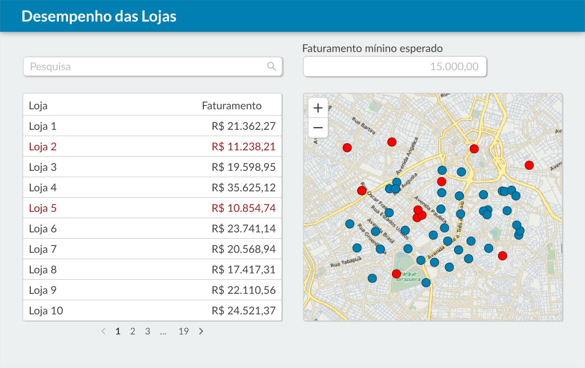

<h1 align="center">
  
</h1>

  Está é uma aplicação ajuda no controle de faturamento de lojas, exibindo as lojas e seus faturamentos, além de exibir suas localizações no mapa, através das coordenadas.

<h2 align="center">Tabela de Conteúdos</h2>

  • <a href="#sobre">Sobre</a>
  • <a href="#funcionalidades">Funcionalidades</a>
  • <a href="#layout">Layout</a>
  • <a href="#tecnologias">Tecnologias</a> 
  • <a href="#status">Status do Projeto</a> 
  • <a href="#autor">Autor</a>
  • <a href="#licenca">Licença</a>

<h2 align="center" id="sobre">Sobre</h2>

  Está é uma aplicação ajudar a ter um controle sobre o faturamento das lojas, são exibidos uma lista com todas as lojas cadastradas, faturamento em vermelho quando o faturamento fica abaixo do valor minimo ex: R$ 15.000,00, essas alteração sáo refletidas no mapa através das coordenadas de latidade e longitude, nome da loja e faturamento.

<h3 align="left" id="funcionalidades">Funcionalidades</h3>

- [x] Mapa: exibir todas as lojas no mapa. As lojas com faturamento inferior ao mínimo
esperado devem estar em vermelho.
- [x] Listagem paginada: ao carregar a página, já trazer uma listagem com (X) lojas por
página ordenadas pelo nome da loja, seguindo o protótipo. As lojas com faturamento
inferior ao configurado no campo “Faturamento mínimo esperado” devem estar em
vermelho.
- [x] Pesquisa: Filtrar as lojas pelo nome, tanto na lista quanto no mapa. O filtro deve ser
aplicado durante a digitação do texto.
- [x] Faturamento mínimo esperado: As alterações neste campo devem refletir na listagem
e no mapa, deixando os itens com valor igual ou inferior destacados em vermelho. O
destaque deve ser aplicado durante a digitação do texto. O valor default desse campo é
15.000,00.
- [x] Permitir reordenar a listagem pelas colunas (em desenvolvimento)

<h2 align="left" id="layout">🎨 Layout da aplicação</h2>
<h1 align="center">
  
</h1>

<h3 align="left" id="layout">Versão Web</h3>

<h3 align="left" id="layout">Versão Mobile</h3>

<h3 align="left" id="tecnologias">🛠 Tecnologias</h3>

As seguintes Tecnologias e Ferramentas que foram usadas na construção do projeto

- [Vite](https://vitejs.dev/)
- [ReactJS](https://pt-br.reactjs.org/)
- [TypeScript](https://www.typescriptlang.org/)
- [Styled-components](https://styled-components.com/)
- [Polished](https://www.npmjs.com/package/polished)
- [PhosphorIcons](https://phosphoricons.com/)
- [Material.UI](https://mui.com/pt/)
- [React-Router-Dom](https://v5.reactrouter.com/web/guides/quick-start)
- [React-Laflet](https://react-leaflet.js.org/docs)

<h2 align="left" id="status">Status do Projeto</h2>

 🚧  ViteJS & ReactJS 🚀 Versão 1.0 Finalizada.  🚧.

<h2 align="left" id="link-online">Versão Online</h2>

- [GFN-FrontEnd-Challenge](https://gfn-frontend-challenge.vercel.app/)

<h2 align="left" id="autor">🦸 Autor</h2>
<a href="https://github.com/JailsonSantos">
 
  
 <b>Jailson Santos</b></a> <a href="https://www.linkedin.com/in/jailson-santos-726395104/" title="Jailson Santos">🚀</a>
  

 

<h2 align="left" id="licenca">📝 Licença</h2>

Este projeto esta sobe a licença [MIT](./LICENSE).

Feito com ❤️ por Jailson Santos 👋🏽 [Entre em contato!](https://www.linkedin.com/in/jailson-santos-726395104/)